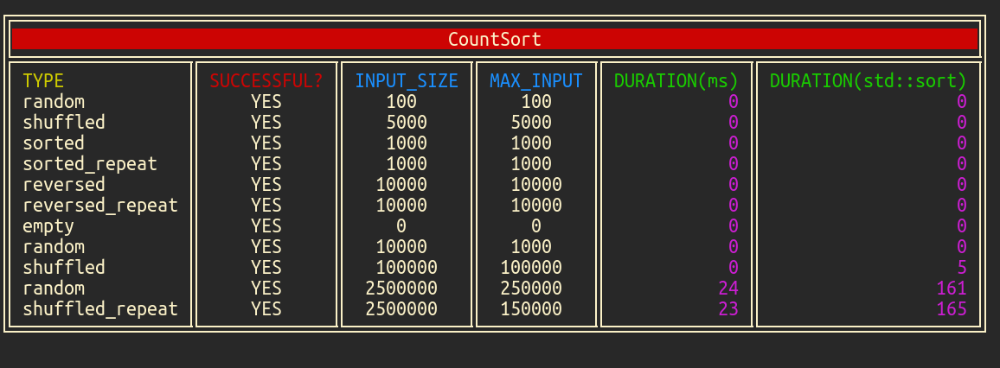
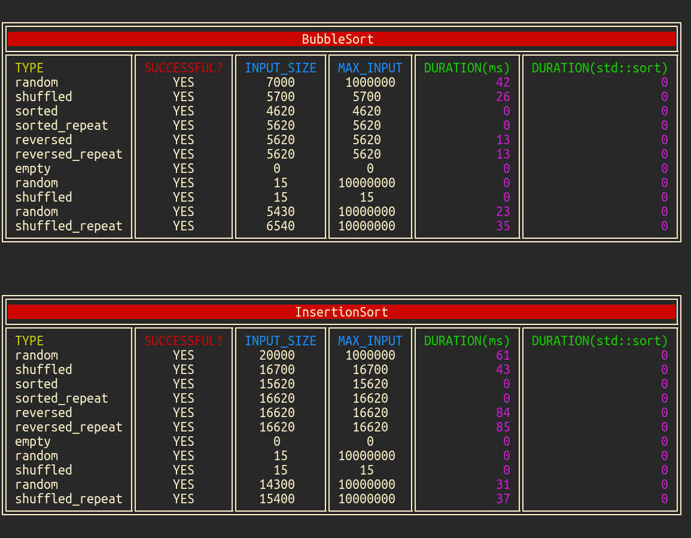
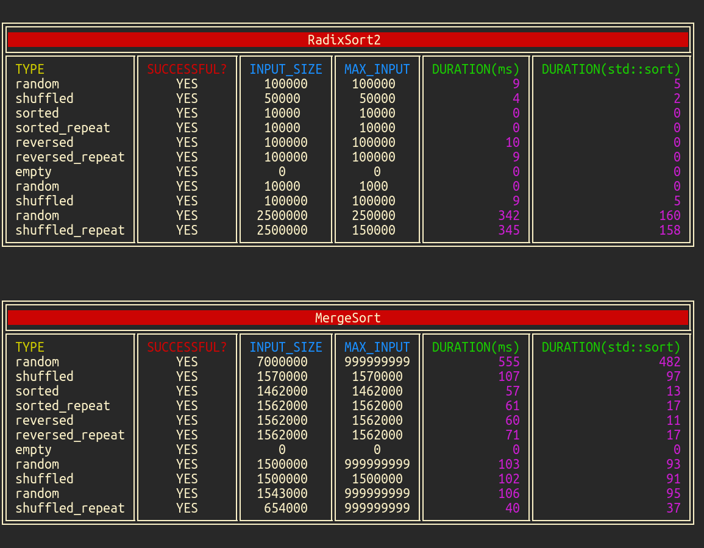
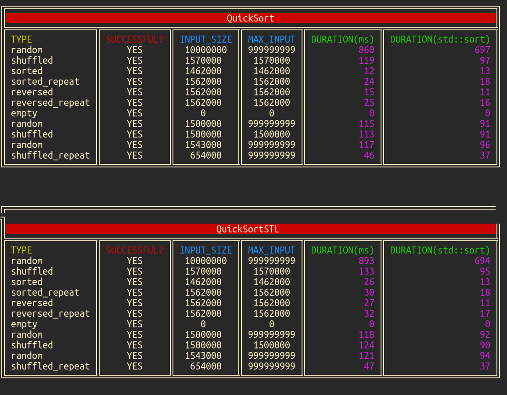

# Prima Tema

## Ce am implementat
- [x] CountSort
- [x] BubbleSort
- [x] InsertionSort
- [x] RadixSort
- [x] MergeSort
- [x] QuickSort

## Structura

Sortarile sunt implementate in [src/main.cpp](https://github.com/AlexandruIca/SD_Tema1/blob/master/src/main.cpp).

Fiecare sortare are un input(fisierele [src/\*.txt](https://github.com/AlexandruIca/SD_Tema1/tree/master/src)).
Primul cuvant de pe fiecare linie reprezinta cum sunt generate numerele pentru
a fi sortate:
* random SIZE MAX -> genereaza SIZE numere random in intervalul [0, MAX)
* shuffled SIZE -> genereaza [0, 1, 2, ..., SIZE - 1] dupa care le amesteca
* shuffled\_rep SIZE -> la fel ca shuffled dar numerele se pot repeta
* sorted SIZE -> genereaza [0, 1, 2, ..., SIZE - 1]
* sorted\_rep SIZE -> la fel ca sorted dar numerele se pot repeta
* reversed SIZE -> genereaza [SIZE - 1, ..., 2, 1, 0]
* reversed\_rep SIZE -> la fel ca reversed dar numerele se pot repeta
* empty -> testeaza pentru []

In [src/sort\_helper.hpp](https://github.com/AlexandruIca/SD_Tema1/blob/master/src/sort_helper.hpp)
este codul care face mai usoara implementarea unei noi sortari si afiseaza
rezultate aranjate in tabele.

## Rulare

TODO: adauga o versiune in care totul e inclus intr-un .cpp.

```sh
cmake -Bbuild -DCMAKE_BUILD_TYPE=Release .
cd build
cmake --build .
cd src/
./Sortari
```

## Demo






